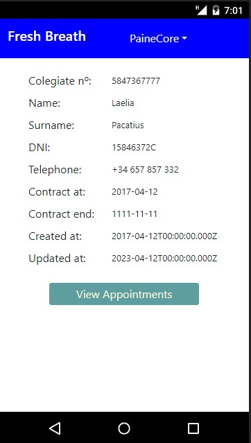
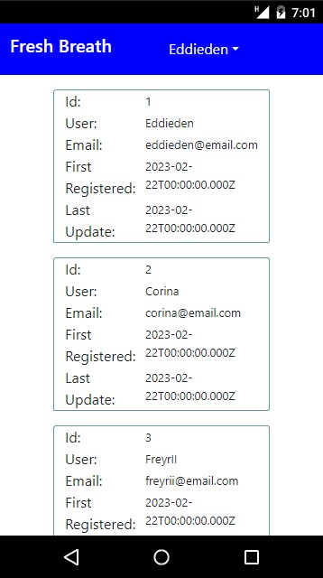

# geekshubs-fsd-val-proyecto_4.2
FrontEnd for the dental care clinique (proyecto 4.1)

# Welcome to my first frontend app  

  <summary>Contenido 📝</summary>
  <ol>
    <li><a href="#objetivo-🎯">Objetivo // Goal 🎯</a></li>
    <li><a href="#sobre-el-proyecto-🔎">Sobre el proyecto // About this project 🔎</a></li>
    <li><a href="#deploy-🚀">Deploy 🚀</a></li>
    <li><a href="#stack">Stack</a></li>
    <li><a href="#instalación-en-local">Instalación en local // Local instalation</a></li>
    <li><a href="#vistas">Vistas // Views</a></li>
    <li><a href="#futuras-funcionalidades">Futuras funcionalidades // Future features</a></li>
    <li><a href="#contribuciones">Contribuciones // Supporting</a></li>
    <li><a href="#webgrafia">Webgrafia: // Webgraphy:</a></li>
    <li><a href="#agradecimientos">Agradecimientos // Thanks</a></li>
    <li><a href="#contacto">Contacto // Contact</a></li>
  </ol>
</details>

---

## Objetivo // Goal 🎯
---
Esta es la segunda parte de un proyecto mayor, esta vez buscamos conectar este frontend con el backend construido anteriormente (https://github.com/IgnacioFurio/geekshubs-fsd-val-proyecto_4.1).

//

This is the second part of a bigger project where the main goal is to connect this front end to the backend build previusly (https://github.com/IgnacioFurio/geekshubs-fsd-val-proyecto_4.1).

---
## Sobre el proyecto // About this project 🔎
---
Este ha sido el proyecto más exigente hasta la fecha, entre controlar los errores, las brechas de seguridad y la conexión con el backend, ha quedado poco tiempo para ajustar las vistas, así que de momento el apartado visual es algo flojo, algo en lo que trabajar de cara al futuro.

//

This was the most demanding project until now because of the error handling, the security breaches and backend conexion, i had not much time left to work at the views, for now, the visual section is not as good as i would like it, something i must work in the future.
  

  ---
## Deploy 🚀
---
<div align="center">
    🚀🚀🚀<a href="https://desarrollo.d3k85qm992iu7j.amplifyapp.com"><strong>Url a producción </strong></a>🚀🚀🚀
</div>

---
## Stack
---
<div align="center">
<a href="https://www.reactjs.com/">
    
</a>
<a href="https://developer.mozilla.org/es/docs/Web/JavaScript">
    
</a>
 </div>

---
## Instalación en local // Local instalation
---
1. Clonar el repositorio // Clone repository
2. ` $ npm install `
3. ``` $ npm run dev ```
4. ...

---
## Vistas // Views
---


Register


Login


Profile


Doctor profile



Admin profile



---
## Futuras funcionalidades // Future features
---

⬜ Filtar por usuario // User filter
⬜ Actualizar datos usuario  // User data update
⬜ Mejorar la interfaz gráfica  // Graphic interface improvement

---
## Contribuciones // Supporting
---

Las sugerencias y aportaciones son siempre bienvenidas.  // Suggestion and support are always welcome

Puedes hacerlo de dos maneras: // There is two differente ways:

1. Abriendo una issue // Open an issue
2. Crea un fork del repositorio // Fork the repository
    - Crea una nueva rama  // Create new branch
        ```
        $ git checkout -b feature/nombreUsuario-mejora
        ```
    - Haz un commit con tus cambios // Make a commit with the changes
        ```
        $ git commit -m 'feat: mejora X cosa'
        ```
    - Haz push a la rama // Push origin your branch
        ```
        $ git push origin feature/nombreUsuario-mejora
        ```
    - Abre una solicitud de Pull Request // Open a Pull Request

---
## Webgrafia: // Webgraphy:
---

- Repositorios de Geeks Hubs Academy  // Geeks Hubs Academy repositories

  <a href="https://github.com/GeeksHubsAcademy/FSDVLC0123ReactTutoria1" target="_blank"></a>
- Documentacion de librerias externas // External libraries official documentation
- Documentación oficial de las tecnologías usadas // Official techs documentation

---
## Agradecimientos: // Thenks:
---

Me gustaría agradecer a nuestro maestro por su paciencia y confianza, nos llevais a nuestros límites, gracias a lo cúal estamos aprendiendo habilidades interesantes.

I want to thank our mentors for your patience and trust, you are pushing us to the limits and we are learning lot of interesting skills.

- **David86dev**  
<a href="https://github.com/Dave86dev" target="_blank"></a> 

- **Datata**
  
  <a href="https://github.com/datata" target="_blank"></a> 
- **MaraScampini**
  
  <a href="https://github.com/MaraScampini" target="_blank"></a> 


## Contacto // Contact

- ***Ignacio***  
<a href="https://www.github.com/userGithub/" target="_blank"></a> 
<a href = "mailto:bichoifj@gmail.com"></a>
<a href="https://www.linkedin.com/in/ignacio-furi%C3%B3-0a9010233/" target="_blank"></a> 
</p>
